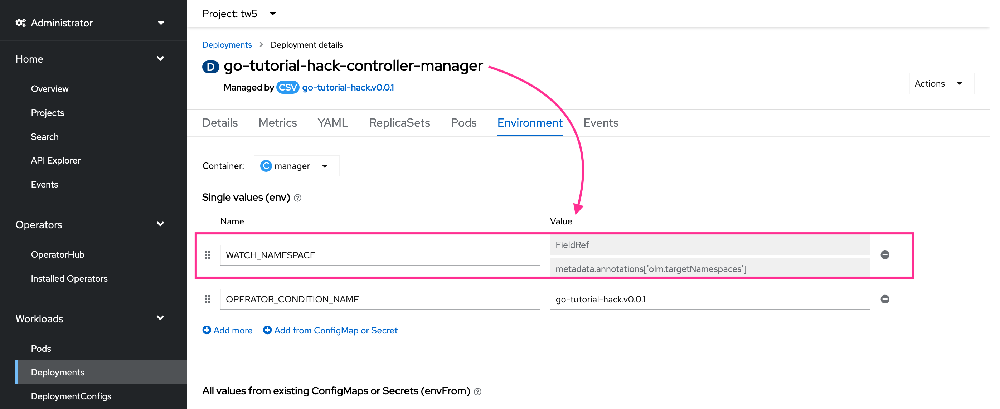
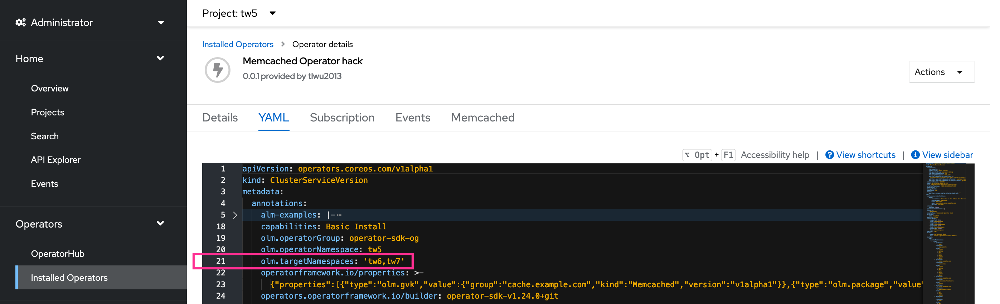

# go-tutorial-hack-multiNS

This is a simple Memcached Operator based on the SDK Go tutorial to show how an Operator dynamically watches namespaces in response to cluster admin's configuration with the help of the OLM.

Keep in mind that `MultiNamespace` installMode could easier lead to "_OperatorGroups with intersecting provided APIs competing for the same resources in the set of intersecting namespaces_" (see [OperatorGroup Intersection](https://olm.operatorframework.io/docs/concepts/crds/operatorgroup/#operatorgroup-intersection)), so it is less recommended if your Operators could be installed more than once on a cluster.

---
(If your Operator will only be installed once on a cluster, let's proceed with caution.)

I went ahead and installed it using the Operator SDK:
```
operator-sdk run bundle quay.io/tlwu2013/go-tutorial-hack-bundle:v0.0.1 -n tw5 --install-mode MultiNamespace=tw6,tw7
```

The above `run bundle` command basically is saying I want:
1. to install Operator in namespace: `tw5`
2. the Operator be installed in `MultiNamespace` installMode, initially watching namespace: `tw6`,`tw7`
3. this Operator allows me to later add an additional namespace: `tw3` as one of the `targetNamespaces` after the installation

That way, tenants of namespace: `tw3` can create `Memcached` custom object there (and know they are able to do so by the `CSV`).

**Step 1.** after the `run bundle` cmd, in the OCP console, you can see the Operator is installed in namespace `tw5` and managing namespace `tw6`,`tw7`


**Step 2.** I created a Memcached custom object in namespace: `tw6`


**Step 3.** The Memcached deployment got 3 pods spun up correctly by the Operator in namespace: `tw6`


**Step 4a.** You can see the manager's `WATCH_NAMESPACE` env var is replaced by the CSV with its `olm.targetNamespaces` annotation


**Step 4b.** as in `CSV`'s YAML


**Step 5.** add namespace: `tw3` as an additional targetNamespace (_This is when could easily cause intersecting/overlapping between the same provided APIs among OperatorGroups if your Operators are installed many times on cluster._)


**Step 6.** OLM would update CSV `olm.targetNamespaces` annotation accordingly and the changes would flow into the manager's `WATCH_NAMESPACE` env var for the additional namespaced cache.


**Step 7.** Created a Memcached custom object in namespace: tw3, and the Memcached deployment spun up 3 pods by the Operator correctly

